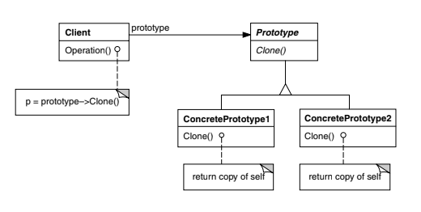

## Padrão Prototype

### Motivação:

Uma confeitaria precisa produzir diversos tipos de doces, como bolos, cupcakes e biscoitos. Criar cada um do zero é custoso, pois exige repetir várias inicializações complexas.

Solução com Prototype:

- Em vez de criar novos doces manualmente, armazenamos protótipos de cada tipo.
- Quando precisamos de um novo doce, apenas clonamos um protótipo existente, reduzindo a necessidade de criar e configurar tudo novamente.
- Isso melhora o desempenho e mantém um fluxo de produção mais eficiente.
  
### Estrutura




@startuml
title Padrão Prototype - Confeitaria 

interface CloneablePastry {
    + clone(): CloneablePastry
}

abstract class Pastry implements CloneablePastry {
    - name: String
    + Pastry(name: String)
    + clone(): Pastry
}

class Cake extends Pastry {
    - layers: int
    + Cake(name: String, layers: int)
    + clone(): Cake
}

class Cupcake extends Pastry {
    - flavor: String
    + Cupcake(name: String, flavor: String)
    + clone(): Cupcake
}

class Cookie extends Pastry {
    - size: String
    + Cookie(name: String, size: String)
    + clone(): Cookie
}

class PastryTool {
    - prototypes: Map<String, CloneablePastry>
    + registerPrototype(key: String, prototype: CloneablePastry)
    + createPastry(key: String): CloneablePastry
}

// Relacionamentos
CloneablePastry <|.. Pastry
Pastry <|-- Cake
Pastry <|-- Cupcake
Pastry <|-- Cookie
PastryTool --> CloneablePastry : "Gerencia protótipos"

@enduml


### Participantes

- Prototype (Graphic) = (Pastry (declara o método clone()))
ConcretePrototype (Staff, WholeNote, HalfNote) = Cake, Cupcake, Cookie (implementam clone())
Client (GraphicTool) = PastryTool (armazena e cria cópias dos protótipos)


## Exemplo:
```js

/*

*/

// Classe base para itens de confeitaria
class Pastry {
    constructor(name) {
        this.name = name;
    }

    clone() {
        const cloneConstructor = this.constructor;
        const properties = Object.assign({}, this);
        return new cloneConstructor(...Object.values(properties));
    }
}

// Produtos concretos (protótipos)
class Cake extends Pastry {
    constructor(name, layers) {
        super(name);
        this.layers = layers;
    }
}

class Cupcake extends Pastry {
    constructor(name, flavor) {
        super(name);
        this.flavor = flavor;
    }
}

class Cookie extends Pastry {
    constructor(name, size) {
        super(name);
        this.size = size;
    }
}

// Ferramenta para gerenciar protótipos
class PastryTool {
    constructor() {
        this.prototypes = {};
    }

    registerPrototype(key, prototype) {
        this.prototypes[key] = prototype;
    }

    createPastry(key) {
        const prototype = this.prototypes[key];
        if (!prototype) {
            throw new Error(`Prototype not registered for key: ${key}`);
        }
        return prototype.clone();
    }
}

// Criando protótipos iniciais
const cakePrototype = new Cake("Chocolate Cake", 3);
const cupcakePrototype = new Cupcake("Vanilla Cupcake", "Vanilla");
const cookiePrototype = new Cookie("Chocolate Chip Cookie", "Large");

// Registrando protótipos na ferramenta
const pastryTool = new PastryTool();
pastryTool.registerPrototype("cake", cakePrototype);
pastryTool.registerPrototype("cupcake", cupcakePrototype);
pastryTool.registerPrototype("cookie", cookiePrototype);

// Criando novas instâncias com base nos protótipos
const newCake = pastryTool.createPastry("cake");
const newCupcake = pastryTool.createPastry("cupcake");
const newCookie = pastryTool.createPastry("cookie");

console.log(newCake);
console.log(newCupcake);
console.log(newCookie);

```

& Implementado por: Adriano Victor e Pedro Victor Hipolito